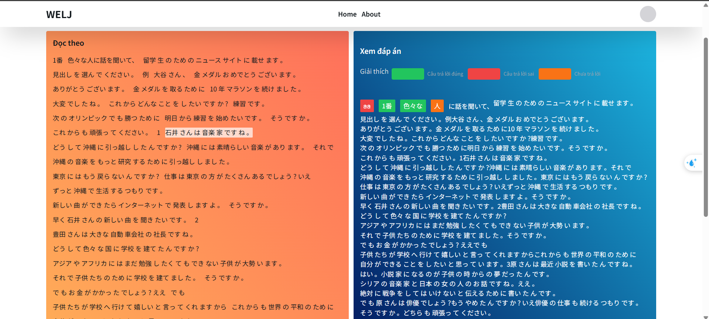
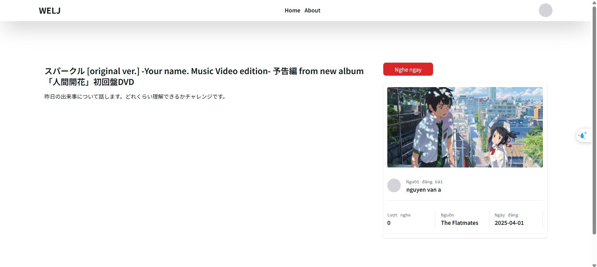
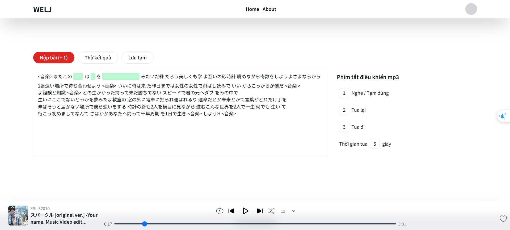
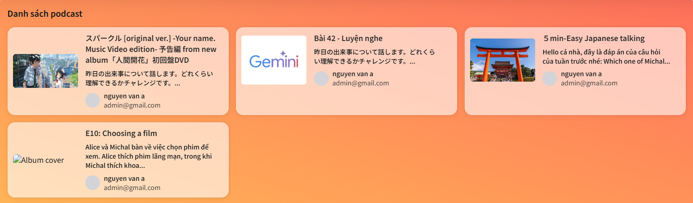

WELJ - Ứng Dụng Nghe Chép Chính Tả
WELJ là một ứng dụng web hỗ trợ người dùng luyện tập kỹ năng nghe và chép chính tả thông qua các bài hát hoặc đoạn audio. Người dùng có thể nghe và điền từ còn thiếu vào đoạn văn bản hiển thị trên màn hình.

🚀 Công Nghệ Sử Dụng
Backend: NestJS - Framework mạnh mẽ dựa trên Node.js

Frontend: ReactJS - Thư viện xây dựng giao diện người dùng

Database: MongoDB - Hệ quản trị cơ sở dữ liệu NoSQL

Frontend UI: Sử dụng TailwindCSS để tạo giao diện trực quan

🎯 Tính Năng Chính
Phát audio và hiển thị đoạn văn bản với các ô trống cần điền.

Cho phép người dùng nhập từ còn thiếu vào ô trống.

Tính điểm và hiển thị kết quả sau khi hoàn thành bài tập.

Lưu kết quả vào cơ sở dữ liệu để theo dõi tiến trình của người dùng.

Điều khiển phát nhạc bằng phím tắt.

🛠 Cài Đặt & Chạy Ứng Dụng
1️⃣ Cài đặt backend (NestJS)
sh
Copy
Edit
cd backend
npm install
npm run start
2️⃣ Cài đặt frontend (ReactJS)
sh
Copy
Edit
cd frontend
npm install
npm run dev

🤝 Đóng Góp
Nếu bạn muốn đóng góp, vui lòng fork repository và tạo pull request. Mọi đóng góp đều được hoan nghênh!

📜 Giấy Phép
MIT License.